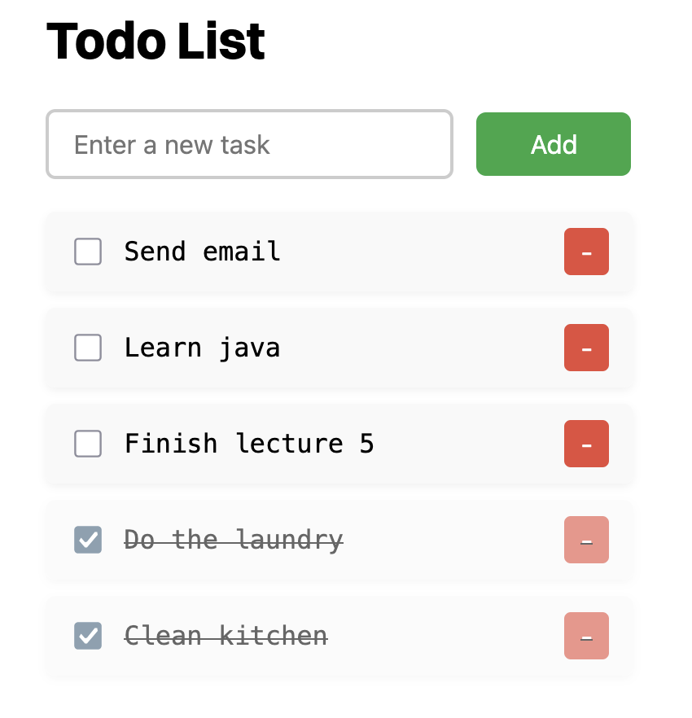
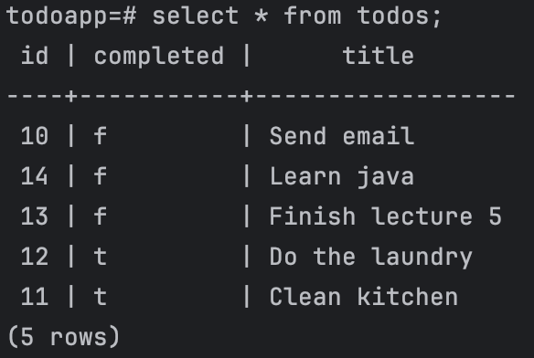

# 📝 ToDo App

A simple todo application built with a **Java + Spring Boot** backend and a **JavaScript** frontend. Tasks are stored in a **PostgreSQL** database. Did this as a project to learn more about java and sql and also to code without a llm...

---

- Add, edit, and delete tasks
- Mark tasks as completed
- RESTful API with Spring Boot
- Storage using PostgreSQL
- JavaScript frontend

---

### Frontend UI

### SQL storage

---

